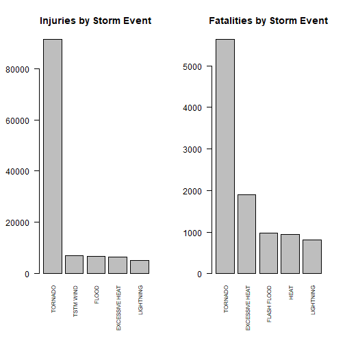
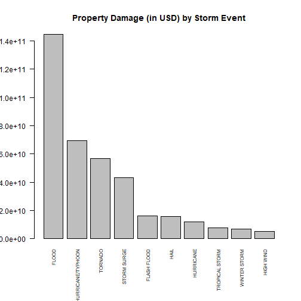
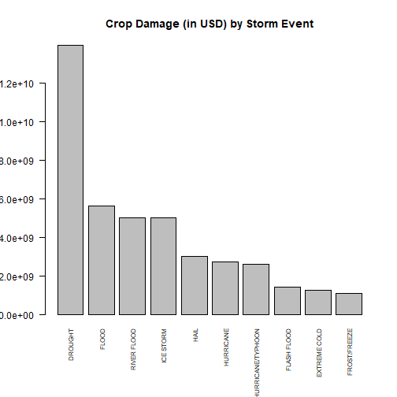

## Introduction / Synopsis

Storms and other severe weather events can cause both public health and economic problems for communities and municipalities. Many severe events can result in fatalities, injuries, and property damage, and preventing such outcomes to the extent possible is a key concern.

This project involves exploring the U.S. National Oceanic and Atmospheric Administration's (NOAA) storm database. This database tracks characteristics of major storms and weather events in the United States, including when and where they occur, as well as estimates of any fatalities, injuries, property and crop damage.

Data has been aggregated by the storm event name and while `total` summaries have been applied to key indicators (`FATALITIES`, `INJURIES`, `PROPERTY` & `CROP DAMAGE`). Each indicator was individually sorted and determined the top `STORM EVENT` that caused it. A barplot for each estimate is generated in this report to help visualize which hydro-meteorological event causes greatest impact to population health and economy.

## Data

The data for this assignment come in the form of a comma-separated-value file compressed via the bzip2 algorithm to reduce its size and it can be downloaded from the course website.

- [Storm Data](https://d396qusza40orc.cloudfront.net/repdata%2Fdata%2FStormData.csv.bz2) [47Mb]

There is also some documentation of the database available. Here you will find how some of the variables are constructed/defined.

- National Weather Service [Storm Data Documentation](https://d396qusza40orc.cloudfront.net/repdata%2Fpeer2_doc%2Fpd01016005curr.pdf)

- National Climatic Data Center Storm Events [FAQ](https://d396qusza40orc.cloudfront.net/repdata%2Fpeer2_doc%2FNCDC%20Storm%20Events-FAQ%20Page.pdf)

The events in the database start in the year 1950 and end in November 2011. In the earlier years of the database there are generally fewer events recorded, most likely due to a lack of good records. More recent years should be considered more complete.

## Problem Statement

The basic goal of this project is to explore the NOAA Storm Database and answer some basic questions about severe weather events. The data analysis will also specifically address the following questions:

1. Across the United States, which types of events (as indicated in the `EVTYPE` variable) are most harmful with respect to population health?

2. Across the United States, which types of events have the greatest economic consequences?

# Assignment

## Packages needed for this project


```r
library(R.utils)
```

```
## Warning: package 'R.utils' was built under R version 3.3.3
```

```r
library(dplyr)
```

```
## Warning: package 'dplyr' was built under R version 3.3.3
```

## Data Processing

Download the data from the course website and unzip the file onto the working directory:


```r
fileUrl <- "https://d396qusza40orc.cloudfront.net/repdata%2Fdata%2FStormData.csv.bz2"
download.file(fileUrl, destfile = "StormData.bz2", mode = "wb")
bunzip2(filename = "StormData.bz2", destname= "StormData.csv", remove = F, overwrite = T)
```

Read the data into R:


```r
stormData <- read.csv("StormData.csv")
```

To address the above objectives, we need the following columns at most and we will reduce the working data to that.

- EVTYPE (the event type)
- FATALITIES (the number of deaths caused by the event)
- INJURIES (the number of injuries caused by the event)
- PROPDMG (the amount of property damage caused by the event)
- PROPDMGEXP (a multiplier code for PROPDMG)
- CROPDMG (the amount of crop damage caused by the event)
- CROPDMGEXP (a multiplier code for CROPDMG)


```r
stormData <- stormData[, c(8,23:28)]
```

Explore the data and determine which needed columns are not having the workable type and content of data.


```r
str(stormData)
```

```
## 'data.frame':	902297 obs. of  7 variables:
##  $ EVTYPE    : Factor w/ 985 levels "   HIGH SURF ADVISORY",..: 834 834 834 834 834 834 834 834 834 834 ...
##  $ FATALITIES: num  0 0 0 0 0 0 0 0 1 0 ...
##  $ INJURIES  : num  15 0 2 2 2 6 1 0 14 0 ...
##  $ PROPDMG   : num  25 2.5 25 2.5 2.5 2.5 2.5 2.5 25 25 ...
##  $ PROPDMGEXP: Factor w/ 19 levels "","-","?","+",..: 17 17 17 17 17 17 17 17 17 17 ...
##  $ CROPDMG   : num  0 0 0 0 0 0 0 0 0 0 ...
##  $ CROPDMGEXP: Factor w/ 9 levels "","?","0","2",..: 1 1 1 1 1 1 1 1 1 1 ...
```

Looks like all columns are in the correct data type. However, based on the Storm Data Documentation, we expect there should only be 5 levels for the mulitplier code:

- blank/no value
- H: for hundreds
- K: for thousands
- M: for millions
- B: for billions

Check the frequency table of `PROPDMGEXP` and determine the significance of uncategorized multiplier codes.


```r
PROP_Count <- table(stormData$PROPDMGEXP)
Percentage <- round(prop.table(PROP_Count)*100,2)
cbind(PROP_Count,Percentage)
```

```
##   PROP_Count Percentage
##       465934      51.64
## -          1       0.00
## ?          8       0.00
## +          5       0.00
## 0        216       0.02
## 1         25       0.00
## 2         13       0.00
## 3          4       0.00
## 4          4       0.00
## 5         28       0.00
## 6          4       0.00
## 7          5       0.00
## 8          1       0.00
## B         40       0.00
## h          1       0.00
## H          6       0.00
## K     424665      47.06
## m          7       0.00
## M      11330       1.26
```

Check the frequency table of `PROPDMG` where `PROPDMGEXP` is blank and determine the significance of `PROPDMG=0`


```r
PROP.blank_Count <- table(as.factor(stormData$PROPDMG[stormData$PROPDMGEXP==""]))
Percentage <- round(prop.table(PROP.blank_Count)*100,2)
cbind(PROP.blank_Count,Percentage)
```

```
##      PROP.blank_Count Percentage
## 0              465858      99.98
## 0.41                1       0.00
## 1                   4       0.00
## 2                   7       0.00
## 3                  16       0.00
## 4                   9       0.00
## 5                  11       0.00
## 6                   6       0.00
## 7                   3       0.00
## 8                   2       0.00
## 9                   3       0.00
## 10                  8       0.00
## 20                  4       0.00
## 35                  1       0.00
## 75                  1       0.00
```

Check the frequency table of `CROPDMGEXP` and determine the significance of uncategorized multiplier codes.


```r
CROP_Count <- table(stormData$CROPDMGEXP)
Percentage <- round(prop.table(CROP_Count)*100,2)
cbind(CROP_Count,Percentage)
```

```
##   CROP_Count Percentage
##       618413      68.54
## ?          7       0.00
## 0         19       0.00
## 2          1       0.00
## B          9       0.00
## k         21       0.00
## K     281832      31.23
## m          1       0.00
## M       1994       0.22
```

Check the frequency table of `CROPDMG` where `CROPDMGEXP` is blank and determine the significance of `CROPDMG=0`


```r
CROP.blank_Count <- table(as.factor(stormData$CROPDMG[stormData$CROPDMGEXP==""]))
Percentage <- round(prop.table(CROP.blank_Count)*100,2)
cbind(CROP.blank_Count,Percentage)
```

```
##   CROP.blank_Count Percentage
## 0           618410        100
## 3                1          0
## 4                2          0
```

It shows from the summary tables that uncategorized multiplier codes constitute to `< 1%` of the number of total observations and that `> 99%` of the blank categories have estimated damage `=0`). Therefore it is safe to assign the value `1` as the multiplier value.

Create new variables to assign the multiplier value based on the multiplier codes.


```r
stormData$PROPDMGMULT <- 1
stormData$PROPDMGMULT[stormData$PROPDMGEXP=="H"|stormData$PROPDMGEXP=="h"] <- 100
stormData$PROPDMGMULT[stormData$PROPDMGEXP=="K"|stormData$PROPDMGEXP=="k"] <- 1000
stormData$PROPDMGMULT[stormData$PROPDMGEXP=="M"|stormData$PROPDMGEXP=="m"] <- 1000000
stormData$PROPDMGMULT[stormData$PROPDMGEXP=="B"|stormData$PROPDMGEXP=="b"] <- 1000000000

stormData$CROPDMGMULT <- 1
stormData$CROPDMGMULT[stormData$CROPDMGEXP=="H"|stormData$CROPDMGEXP=="h"] <- 100
stormData$CROPDMGMULT[stormData$CROPDMGEXP=="K"|stormData$CROPDMGEXP=="k"] <- 1000
stormData$CROPDMGMULT[stormData$CROPDMGEXP=="M"|stormData$CROPDMGEXP=="m"] <- 1000000
stormData$CROPDMGMULT[stormData$CROPDMGEXP=="B"|stormData$CROPDMGEXP=="b"] <- 1000000000
```

Create new variables pertaining to the actual property or crop damage in US dollars


```r
stormData$PROPDMGVAL <- stormData$PROPDMG*stormData$PROPDMGMULT
stormData$CROPDMGVAL <- stormData$CROPDMG*stormData$CROPDMGMULT
```

The dataset is now workable and ready for analysis.

## Results

#### **Question 1:** Across the United States, which types of events (as indicated in the `EVTYPE` variable) are most harmful with respect to population health?

### POPULATION HEALTH INDICATORS as AFFECTED by STORM EVENTS ACROSS U.S.

As described in the Storm Data Documentation, fatalities and injuries directly or indirectly caused by the weather event are entered in the Storm Data software "fatality" and "injury" entry fields, respectively. We utilized the `INJURIES` and `FATALITIES` columns as main indicators of population health.


```r
total_inj <- aggregate(INJURIES ~ EVTYPE, stormData, sum)
top_inj <- head(arrange(total_inj, desc(INJURIES)),5)

total_ftl <- aggregate(FATALITIES ~ EVTYPE, stormData, sum)
top_ftl <- head(arrange(total_ftl, desc(FATALITIES)),5)
```

The chart below shows the total cases of INJURIES and FATALITIES by EVENT TYPE.
The predominant storm event that impacts to population health is **TORNADO** for both injuries and fatalities.


```r
head(top_inj,1)
```

```
##    EVTYPE INJURIES
## 1 TORNADO    91346
```

```r
head(top_ftl,1)
```

```
##    EVTYPE FATALITIES
## 1 TORNADO       5633
```

```r
par(mfrow=c(1,2), mar=c(7,4,4,2), las = 2)
barplot(top_inj$INJURIES,
        names=top_inj$EVTYPE,
        main = "Injuries by Storm Event",
        cex.names = 0.7)
barplot(top_ftl$FATALITIES,
        names=top_ftl$EVTYPE,
        main = "Fatalities by Storm Event",
        cex.names = 0.7)
```



#### **Question 2:** Across the United States, which types of events have the greatest economic consequences?

Property damage estimates are entered as actual dollar amounts, if a reasonably accurate estimate from an insurance company or other qualified individual is available. If this estimate is not available, then the preparer has two choices: either check the "no information available" box, or make an estimate. The damage has been estimated in good faith by the preparer of the dataset.  Property damage estimates are very important for many users and should be obtained if at all possible.

Crop damage information were obtained only from reliable sources, such as the U.S. Department of Agriculture (USDA), the county/parish agricultural extension agent, the state department of agriculture, crop insurance agencies, or any other reliable authority.  Crop damage amounts were obtained from the USDA or other similar agencies.

For this data analysis project, we utilized `PROPERTY` and `CROP` damage information (expressed in USD) to infer which storm events have greatest economic impacts.


```r
total_propdmg <- aggregate(PROPDMGVAL ~ EVTYPE, stormData, sum)
top_propdmg <- head(arrange(total_propdmg, desc(PROPDMGVAL)),10)

total_cropdmg <- aggregate(CROPDMGVAL ~ EVTYPE, stormData, sum)
top_cropdmg <- head(arrange(total_cropdmg, desc(CROPDMGVAL)),10)
```

The predominant storm event that affects the economy in terms of Property Damage is **FLOOD**.


```r
head(top_propdmg,1)
```

```
##   EVTYPE   PROPDMGVAL
## 1  FLOOD 144657709807
```

```r
par(mfrow=c(1,1), mar=c(7,4,4,2), las = 2)
barplot(top_propdmg$PROPDMGVAL,
        names=top_propdmg$EVTYPE,
        main = "Property Damage (in USD) by Storm Event",
        cex.names = 0.7)
```



The predominant storm event that affects the economy in terms of Crop Damage is **DROUGHT**.


```r
head(top_cropdmg,1)
```

```
##    EVTYPE  CROPDMGVAL
## 1 DROUGHT 13972566000
```

```r
par(mfrow=c(1,1), mar=c(7,4,4,2), las = 2)
barplot(top_cropdmg$CROPDMGVAL,
        names=top_cropdmg$EVTYPE,
        main = "Crop Damage (in USD) by Storm Event",
        cex.names = 0.7)
```



